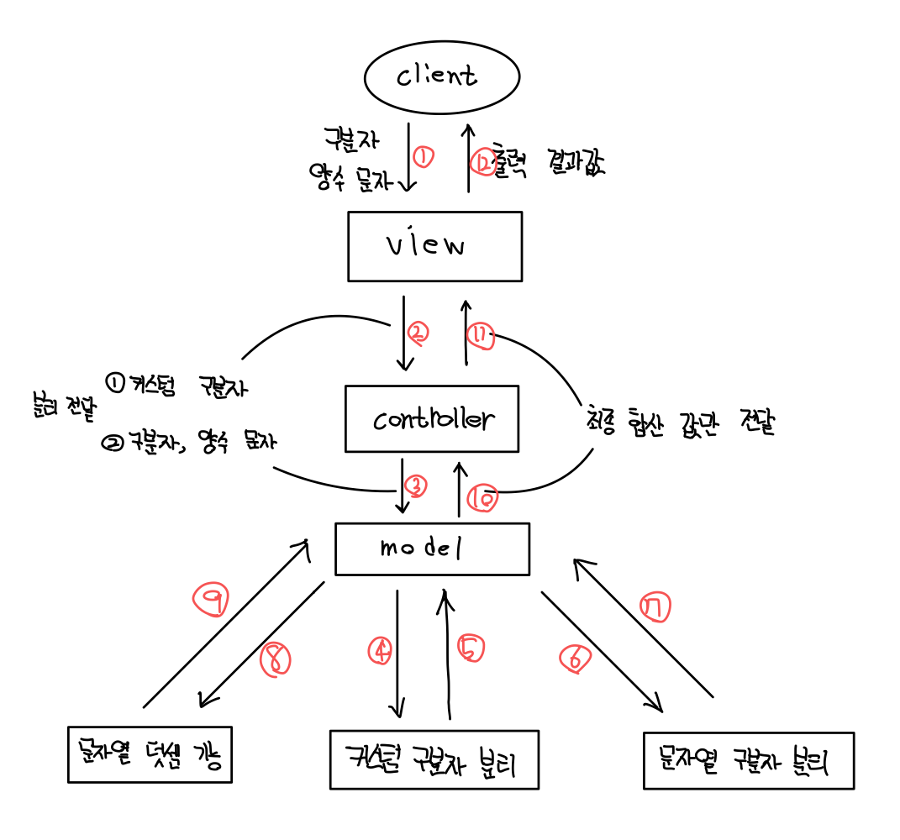

# 문자열 덧셈 계산기 🚀

## 기능 구현 목록

### 문자열 구분자 분리 기능
- [ ] 커스텀 문자열이 없을 경우 ',' 또는 ':' 로 구분해 반환
- [ ] 커스텀 문자열이 있을 경우 함께 구분해 반환
    - 구분자에 알맞지 않을 경우 `IllegalArgumentException` 예외 발생

### 문자열 덧셈 기능
- [ ] 문자열을 숫자로 변경해 최종 결과값 추출
    - 양수로 구성된 문자열이 아닌 경우 `IllegalArgumentException` 예외 발생

### 커스텀 구분자 추출 기능
- [x] 커스텀 구분자가 존재할 경우 추출
    -  ex) `"//;\n` ';' 추출
    - 올바르지 않은 커스텀 구분자 설정일 경우 `IllegalArgumentException` 예외 발생

### 입력
- [ ] 구분자와 양수로 구성된 문자열
    - ex) `"" => 0, "1,2" => 3, "1,2,3" => 6, "1,2:3" => 6`
- [ ] 커스텀 구분자와 양수로 구성된 문자열
    - ex)  `"//;\n1;2;3" => 6`

### 출력
- [ ] 계산기 시작 출력문
    - ex)  `"덧셈할 문자열을 입력해 주세요."`
- [ ] 덧셈 결과 출력문
    - ex) `"결과 : 6"`

### 비즈니스 로직 설계 구성도
